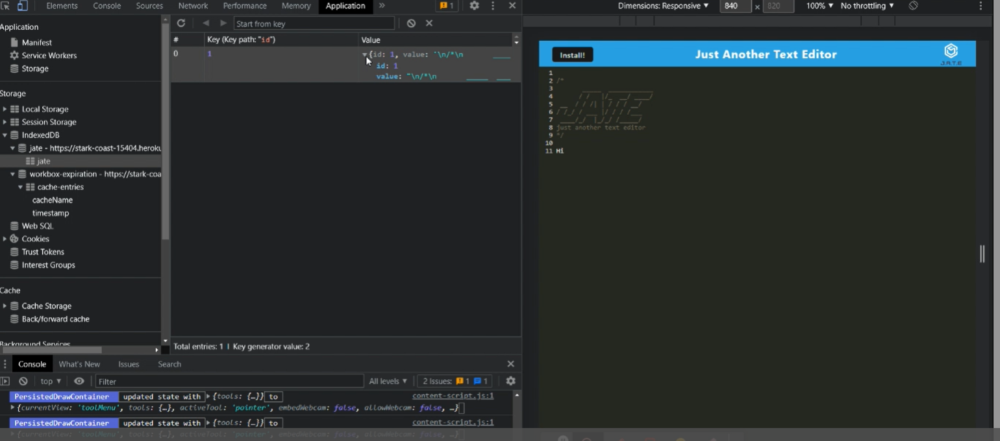

# PWA-text-editor
Progressive Web Applications (PWA): Text Editor

## Description
A text editor that runs in the browser. The app is a single-page application that meets the  
PWA criteria.  
 
Additionally, it features a number of data persistence techniques that serve as redundancy   
in case one of the options is not supported by the browser. The application also functions offline.

## Usage
Use the link to the deployed site on Heroku.  
Once the app is launched you can start using the text editor.  
Inspect the Development Tools - to access the Manifest, Service Workers, IndexedDB and the Cache entries. 

## Technology Used
Manifest  
Service Workers 
IndexedDB  
Cache  
JavaScript  
Workbox  
PWA webpack  
Express  
Heroku  

## Mockup
A link to the deployed app on Heroku: 'https://stark-coast-15404.herokuapp.com/'

## Contribution Guidelines
Your suggestions and comments are welcome on the text editor. 

We use Github and all it's built-in features to host the website, and to pull requests to the local repository.

Report all bugs to Github <a href="https://github.com/issues" target="_blank">issues</a> 

This website uses semantic HTML elements, and universal, element, and class selectors in CSS.

# License
All submissions to this project will fall under <a href="https://choosealicense.com/licenses/mit/" target="_blank">issues</a>
